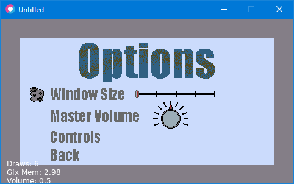
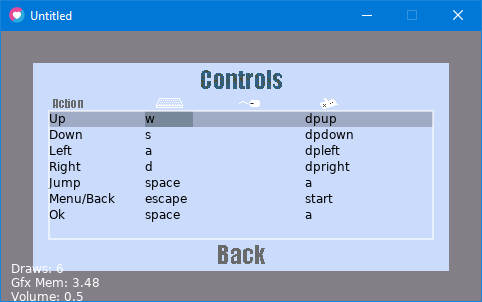
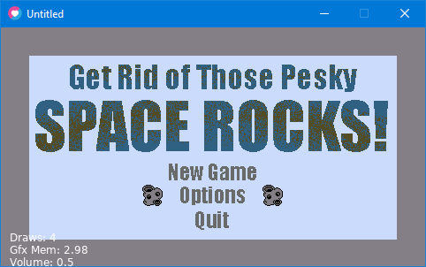
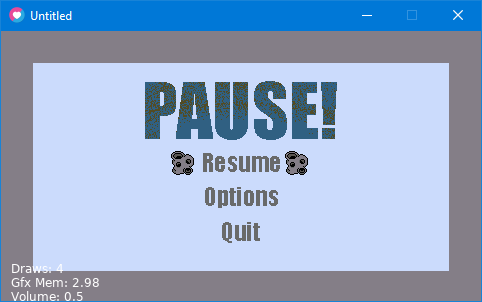

# Space-Rocks

## In Progress:
- Saving the configuration after you have changed it
- Splash Screen
- Example endgame menu/screen
- Example game

## Complete:
- Overall game logic / framework
- Menus: Main menu, options, controls, pause
- Settings: Volume Control and Resolution size
- Controls: Mappable keyboard and gamepad buttons

## For a later time:
- Multiple players
- mouse control mapping

